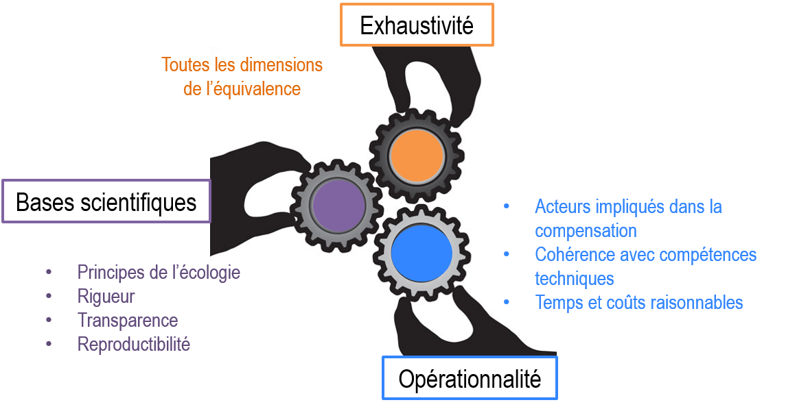

# ECOVAL

ECOVAL est un cadre méthodologique qui permet d’évaluer l’équivalence écologique
entre les pertes de biodiversité engendrées par les projets d’aménagements,
et les gains de biodiversité apportés par les mesures compensatoires associées.
Il a été développé dans le cadre d’une thèse CIFRE en partenariat avec EDF R&D,
Irstea (LESSEM) et le Museum National d’Histoire Naturelle (CESCO),
et testé dans le cadre d’un postdoc en partenariat avec EDF R&D, Irstea (LESSEM)
et également par l’UMS PatriNat dans le cadre de ses partenariats.
Cette interface a été développée par EDF R&D pour faciliter l’utilisation d’ECOVAL
en permettant l’import et la saisie des données, le calcul automatisé des indicateurs,
la transparence des prédictions et la génération automatisée des sorties graphiques.

  

   <b>Principe méthodologique</b> 

# Bibliographie

* Lucie Bezombes, [Développement d'un cadre méthodologique pour l'évaluation de l'équivalence écologique : Application dans le contexte de la séquence "Éviter, Réduire, Compenser" en France](https://tel.archives-ouvertes.fr/tel-01746852), thèse, 2017

# Licence

[CeCILL](http://www.cecill.info/index.en.html) v2.1

# Contribution

Pour toute demande veuillez faire une demande via l'onglet  *Issues*.

